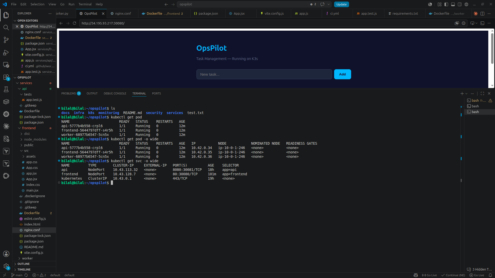
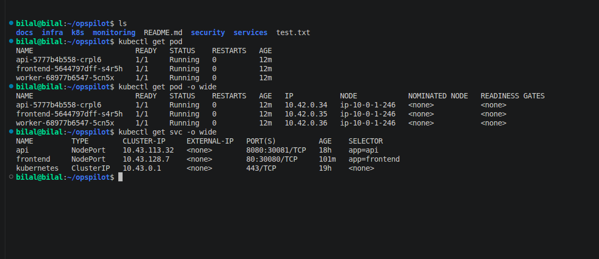
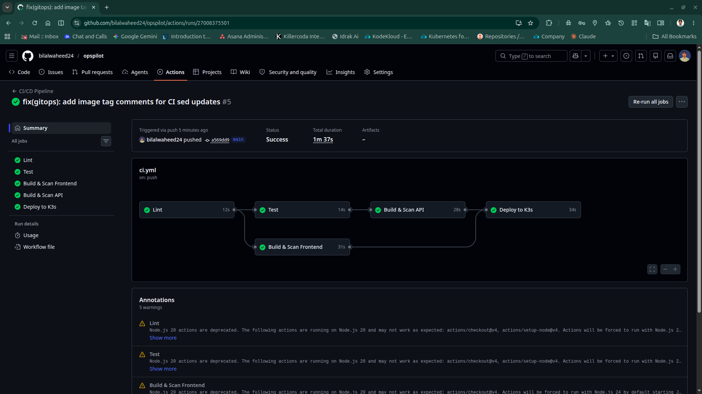
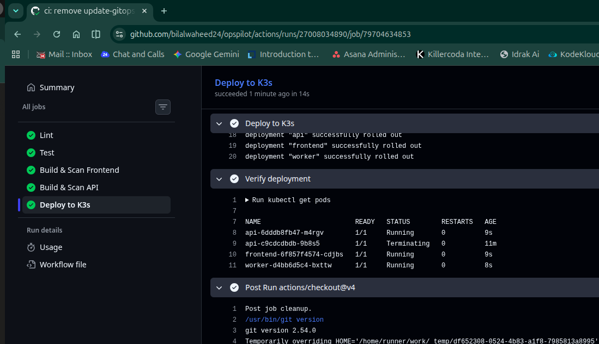
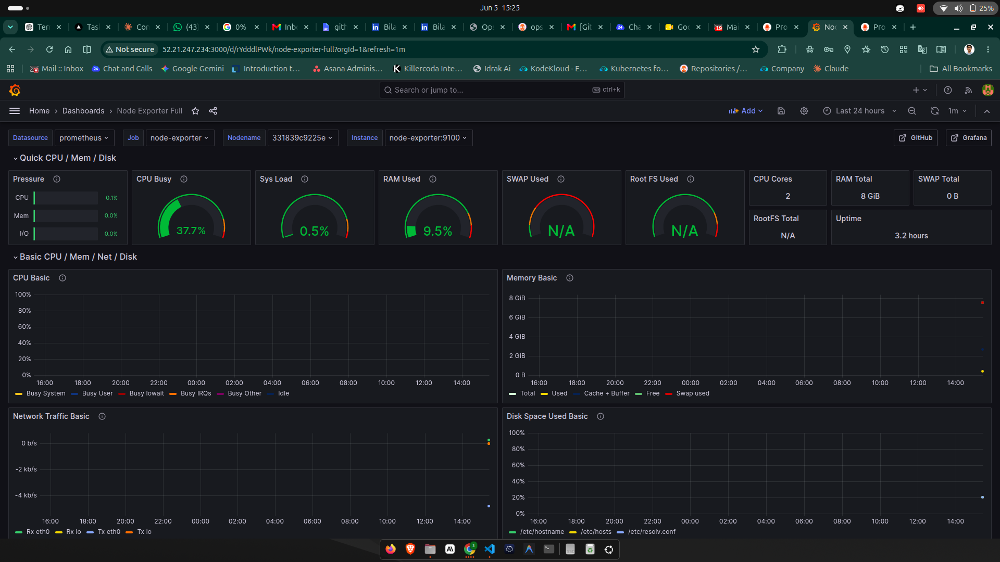
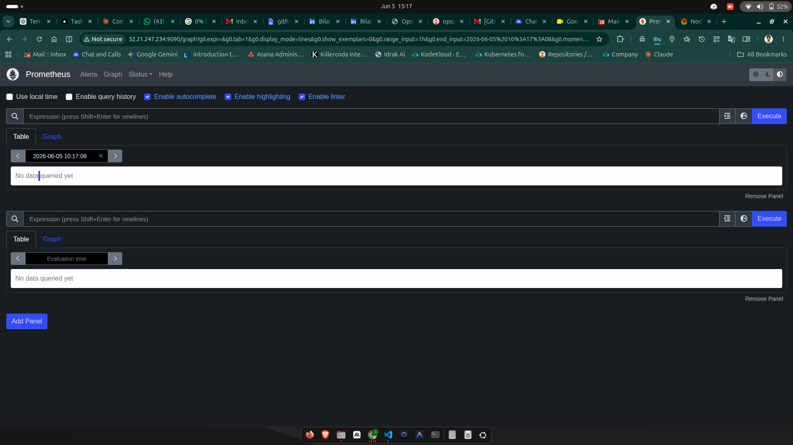

# OpsPilot — Production DevOps Platform

> End-to-end DevOps implementation on AWS Free Tier. Zero cost. Enterprise patterns.

[](https://github.com/bilalwaheed24/opspilot/actions/workflows/ci.yml)

---

## Live Demo

- **Frontend:** http://34.195.93.217:30080
- **Grafana:** http://52.21.247.234:30091

---

## Screenshots

### OpsPilot — Live Application on K3s


### Kubernetes Cluster — All Pods Running


### CI/CD Pipeline — All Stages Green


### Deploy to K3s — Successful Rollout


### Grafana Monitoring Dashboard


### Prometheus Metrics


---

## Tech Stack

| Category | Tools |
|----------|-------|
| Cloud | AWS EC2, VPC, EIP |
| IaC | Terraform |
| Containers | Docker, GHCR |
| Orchestration | K3s Kubernetes (2-node cluster) |
| CI/CD | GitHub Actions |
| GitOps | ArgoCD |
| Monitoring | Prometheus, Grafana |
| Security | OPA Gatekeeper, Trivy |

---

## What This Demonstrates

| Concern | Implementation |
|---------|---------------|
| IaC | Terraform modules, S3 remote state, DynamoDB lock |
| Orchestration | K3s 2-node cluster, resource limits, probes |
| GitOps | ArgoCD automated sync, self-heal, prune |
| Security | OPA policies block root containers, Trivy CVE scanning |
| Observability | Prometheus scraping, Grafana dashboards, node metrics |
| Cost | $0/month — 100% AWS Free Tier |

---

## Services

| Service | Stack | Port |
|---------|-------|------|
| Frontend | React + Vite + Nginx | 30080 |
| API | Node.js + Express + prom-client | 30081 |
| Worker | Python (background processor) | — |
| Prometheus | prom/prometheus | 30093 |
| Grafana | grafana/grafana | 30091 |

---

## CI/CD Pipeline

Every `git push` to `main` automatically:

1. Lint (ESLint + flake8)
2. Unit Tests (Jest — 4 tests, 72% coverage)
3. Docker Build (multi-stage, non-root user)
4. Trivy Security Scan (blocks on CRITICAL CVEs)
5. Push to GHCR
6. Deploy to K3s (kubectl rollout)
7. Verify all pods Running

**Total pipeline time: ~1m 37s**

---

## Infrastructure

```bash
# Provision entire AWS infrastructure
cd infra && terraform apply

# Deploy all services to K3s
kubectl apply -k k8s/overlays/prod

# Check status
kubectl get pods
kubectl get nodes
```

---

## Cost Breakdown

| Service | Free Tier Limit | Cost |
|---------|----------------|------|
| 2x EC2 m7i-flex.large | Free tier eligible | $0 |
| S3 (Terraform state) | 5GB free | $0 |
| DynamoDB (state lock) | 25GB free | $0 |
| GHCR (container registry) | Free for public repos | $0 |
| GitHub Actions | 2000 min/month free | $0 |
| **Total** | | **$0/month** |

---

## Repository Structure

```
opspilot/
├── .github/
│   └── workflows/
│       └── ci.yml                  # CI/CD pipeline
├── docs/
│   ├── adr/                        # Architecture Decision Records
│   ├── runbooks/                   # Operational runbooks
│   └── screenshots/                # Proof-of-work images
├── infra/                          # Terraform IaC (AWS)
│   ├── bootstrap/                  # S3 + DynamoDB state backend
│   ├── modules/
│   │   ├── ec2/
│   │   ├── security/
│   │   └── vpc/
│   ├── backend.tf
│   ├── main.tf
│   └── providers.tf
├── k8s/                            # Kubernetes manifests (Kustomize)
│   ├── argocd-app.yaml             # ArgoCD Application definition
│   ├── base/
│   │   ├── api/
│   │   ├── frontend/
│   │   ├── monitoring/             # Prometheus + Grafana + node-exporter
│   │   ├── networkpolicies/
│   │   └── worker/
│   └── overlays/
│       └── prod/                   # ArgoCD watches this path
├── monitoring/                     # Raw configs (mounted as ConfigMaps)
│   ├── alertmanager/
│   ├── grafana/
│   └── prometheus/
├── security/
│   └── opa-policies/               # OPA Gatekeeper constraints
│       ├── deny-latest-tag.yaml
│       └── require-non-root.yaml
├── services/
│   ├── docker-compose.yml
│   ├── api/                        # Node.js + Express
│   │   ├── src/app.js
│   │   ├── tests/app.test.js
│   │   ├── Dockerfile
│   │   └── package.json
│   ├── frontend/                   # React + Vite + Nginx
│   │   ├── src/
│   │   │   ├── App.jsx
│   │   │   ├── App.css
│   │   │   ├── index.css
│   │   │   └── main.jsx
│   │   ├── public/
│   │   ├── Dockerfile
│   │   ├── nginx.conf
│   │   └── vite.config.js
│   └── worker/                     # Python background processor
│       ├── src/worker.py
│       ├── Dockerfile
│       └── requirements.txt
├── .gitignore
└── README.md
```

---

## Author

**Bilal Waheed** — Junior DevOps Engineer

- GitHub: [github.com/bilalwaheed24](https://github.com/bilalwaheed24)
- Email: thebilalwaheed@gmail.com
- LinkedIn: [linkedin.com/in/bilalwaheed](https://linkedin.com/in/bilalwaheed)

